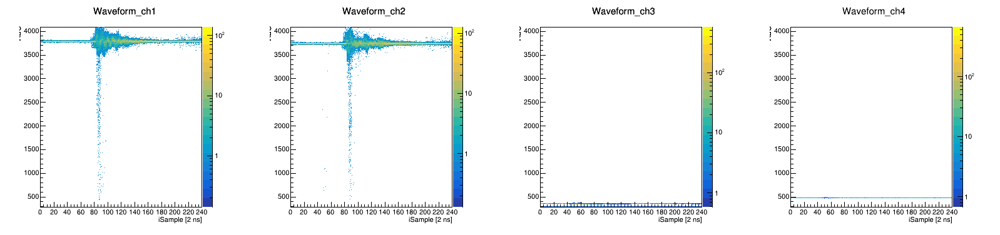

DAQ code for NOTICE KOREA FADC500 standalone 
## DAQ  

`./INIT.sh` : Initialize minitcb & NKFADC500 according to setup_singlemodule.txt
- ***EXECUTE ONE MORE TIME*** if Pedestal is not well applied;    ex) Pedestal: 2000  0  2000  0 

`./RUN.sh` : Specifies how many buffers to receive as an argument; if no argument is given, it will continue receiving indefinitely
- 1 buffer = 8 Events for Recording Length = 512 ns
- Display the number of buffers when they accumulate every 10 counts

`./STOP.sh` : Stop the ongoing run

## Draw figures at ./macro

`root -l 'Waveform_overlap.cpp( RUNNUMBER_TO_DRAW )`
- This code draw this:

`root -l 'Draw.cpp( RUNNUMBER_TO_DRAW )` : Visualize the data from the given RUNNUMBER as an argument
- **WAVEFORM + PEDSTAL + ADC PEAK**	
- Get ADC(waveform), triggered time, etc from `./data/FADCData_RUNNO.root`
- Get Threshold, TRGLogic from `./data/log_RUNNO.txt`
- Figure is saved at `./fig/RUNNUMBER_TO_DRAW.pdf`
- example here: 

